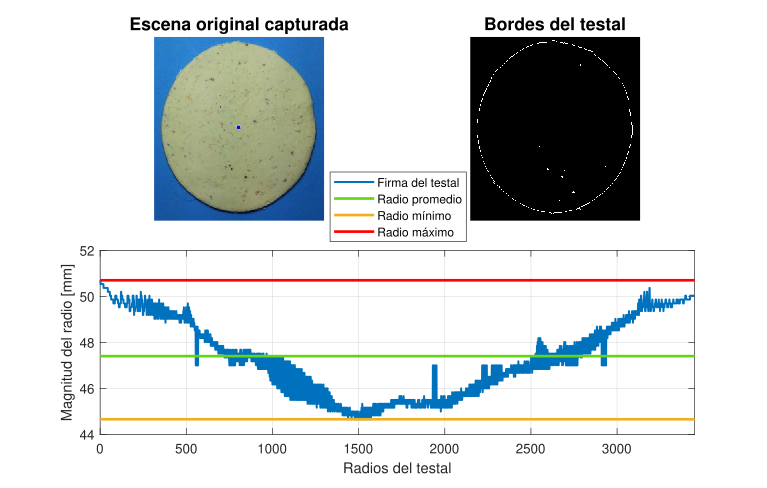

# Medición de parámetros de testales

    

Los métodos de segmentación de regiones  permiten trabajar solamente con la información de la imagen esencial para el procesamiento, un método que permite trabajar a la imagen con información en el intervalo discreto $[0,1]$ es la binarización. Éste método de segmentación presenta una imagen que solamente contiene la información de las regiones que presentan una distribución de intensidad similar. La binarización por umbral permite extraer la mayor información posible en el intervalo mencionado, ya que desde el punto de vista del tratamiento de imágenes, un umbral se identifica cono un valor de intensidad a partir del cual un grupo determinado de píxeles serán considerados como pertenecientes a un subconjunto determinado y catalogados como blancos (1), mientras que el resto se asignan a un segundo subconjunto, siendo en este caso etiquetados como negros (0) [1, p. 100].

 <h2>Bordes de la imagen</h2>
    
Para resaltar aquellos píxeles considerados frontera o que estén cerca de ella, se utiliza el gradiente ya que permite determinar si un píxel es o no de borde. El gradiente de una imagen $f(x,y)$ en un punto de coordenadas $(x,y)$ se define como un vector bidimensional, siendo perpendicular al borde [1, p. 105].

<h2>Firma de la imagen</h2> 

Consiste en la detección de puntos de interés en la imagen en los que se producen diferencias de gradiente significativas y luego construir un histograma con la información de la distancia de los puntos de interés a otro en específico, el centroide; esto permite generar un conjunto de datos único para cada tipo de imagen y a partir de intervalos establecidos, conocer si la imagen de la que se trata tiene alguna morfología en particular o no.

